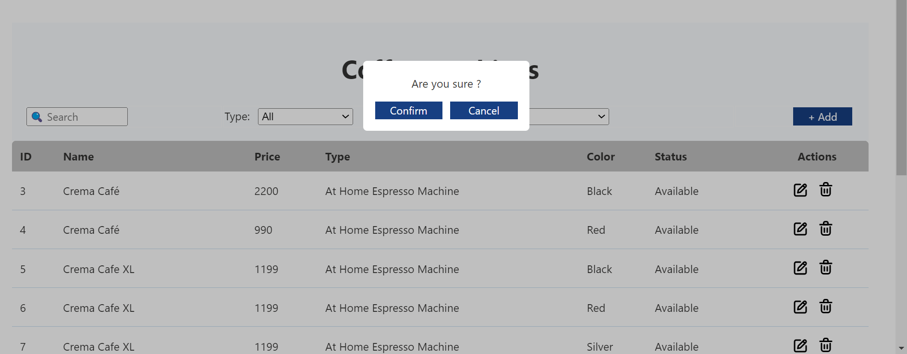

# CoffeeMachinesWebPart

## PreView

## Summary

Simple crud operation over sharepoint list with SPFx web part. 

Additional functionallity:
 - Filterring

 - Sorting

 - Pagintion (still have some issuess {Improving})
    

 - Searching

- Add Item

- Update Item

- Delete Item

---

## Applies to

- [SharePoint Framework](https://aka.ms/spfx)
- [Microsoft 365 tenant](https://docs.microsoft.com/en-us/sharepoint/dev/spfx/set-up-your-developer-tenant)

## Prerequisites

- Basic Knowledge of React (I had some knowledge of NextJS and Angular, this is my first project on ReactJS)
- Basic Knowledge of sharepoint (I just learn about sharepoint 3 week ago)
- basic knowledge of pnpjs (this is my first time using pnpjs)

## Minimal Path to Awesome

- Clone this repository
- Ensure that you are at the solution folder
- in the command-line run:
  - **npm install**
  - **npm start**
  - **npm pack**
- find "*.sppkg" file in the sharepoint/solution folder 
- Deploy it in Sharepoint

## References

- [PnpJS Installation](https://pnp.github.io/pnpjs/packages/#core)
- [PnPJS Getting Started](https://pnp.github.io/pnpjs/)
- [Getting started with SharePoint Framework](https://docs.microsoft.com/en-us/sharepoint/dev/spfx/set-up-your-developer-tenant)
- [Building for Microsoft teams](https://docs.microsoft.com/en-us/sharepoint/dev/spfx/build-for-teams-overview)
- [Use Microsoft Graph in your solution](https://docs.microsoft.com/en-us/sharepoint/dev/spfx/web-parts/get-started/using-microsoft-graph-apis)
- [Publish SharePoint Framework applications to the Marketplace](https://docs.microsoft.com/en-us/sharepoint/dev/spfx/publish-to-marketplace-overview)
- [Microsoft 365 Patterns and Practices](https://aka.ms/m365pnp) - Guidance, tooling, samples and open-source controls for your Microsoft 365 development

## Disclaimer

**THIS CODE IS PROVIDED _AS IS_ WITHOUT WARRANTY OF ANY KIND, EITHER EXPRESS OR IMPLIED, INCLUDING ANY IMPLIED WARRANTIES OF FITNESS FOR A PARTICULAR PURPOSE, MERCHANTABILITY, OR NON-INFRINGEMENT.**

---